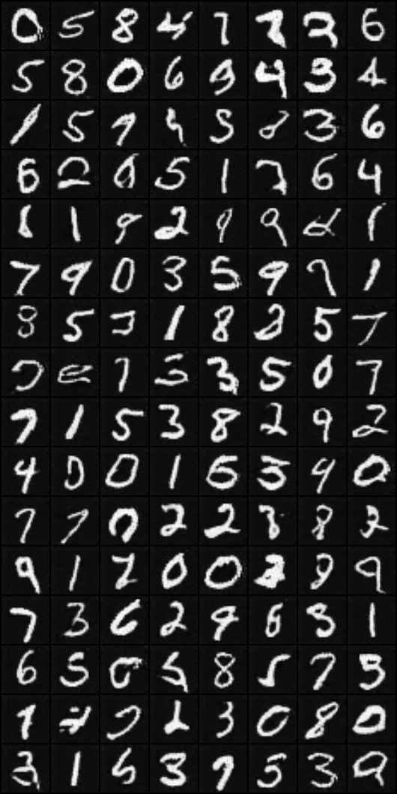
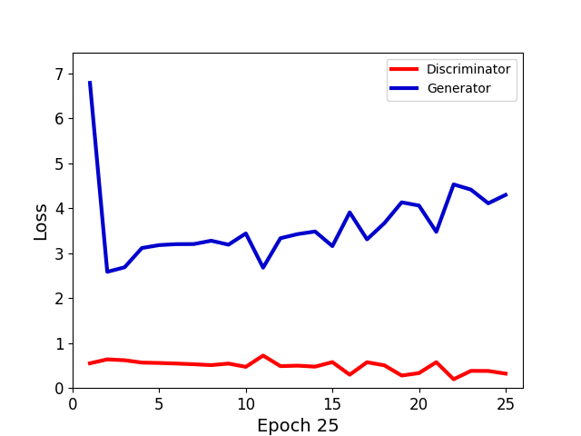

# DCGAN-pytorch
Yet another pytorch implementation of Deep Convolutional Generative Adversarial Networks
# Dependencies
- Python 3.7.7
- PyTorch version: 1.7.0
- CUDA version: 11.1

# Usage
- Training using Mnist dataset
```sh
sh train_mnist.sh
```
# Result
- Mnist Generated image

- Training loss
